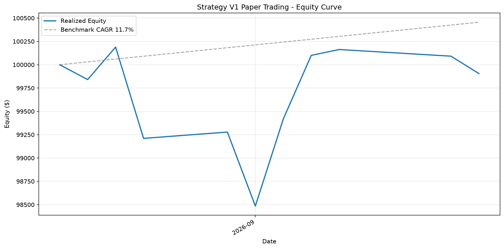

# 策略 V1 月度績效報告

生成時間：2026-09-10 11:14:18

資料期間：2026-08-25 至 2026-09-09
交易日數：10 日

## 權益曲線



## 績效指標對比

```
⚠️ Sharpe ratio         實現    -0.21  預期     0.91
⚠️ CAGR                 實現    -2.4%  預期    11.7%
✓ 最大回撤                 實現    -1.7%  預期   -24.6%
⚠️ 獲利因子                 實現     0.96  預期     1.17
```

**⏳ 樣本數不足**：目前 10 日，
需至少 90 日才能對偏離做統計推斷。
短期波動遠大於訊號，好壞都不構成結論。

## 交易摘要

- 起始權益：$100,000
- 現在權益：$99,905
- 總報酬：-0.10%
- 實現波動：9.4% 年化
- 再平衡次數：1
- 累計成本：$159.24

## ✅ 狀態：正常

無觸發失敗門檻。策略按預期運作。

## 回測基準

- 期間：2018-11 to 2026-08 (1646 樣本外日)
- Sharpe：0.91
- CAGR：11.7%
- 最大回撤：-24.6%
- 獲利因子：1.17
- 來源：`scripts/run_risk_bucket_study.py bucket_equal arm, WFO holdout`

---
_報告由 `scripts/report_v1_monthly.py` 自動生成_